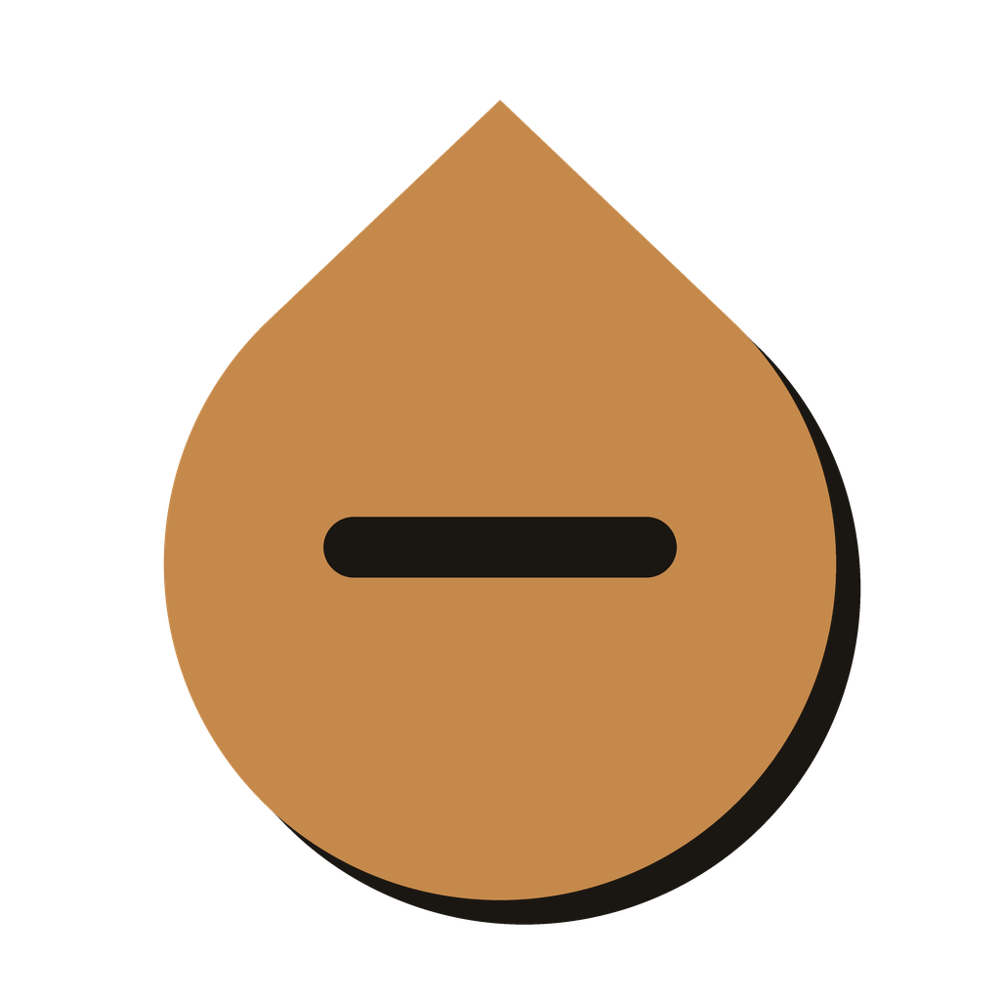
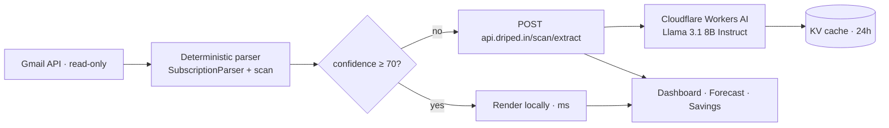

<!-- =====================================================================
     Driped Android — Stop the Drip, in your pocket
     ===================================================================== -->

<div align="center">



# 💧 Driped — Android

### **Stop the drip.** Catch every recurring charge in your inbox, on your phone.

<a href="https://driped.in"></a>


<br />

<a href="https://github.com/Abhinavv-007/DRIPED-Android/stargazers"></a>
<a href="https://github.com/Abhinavv-007/DRIPED-Android/commits/main"></a>


<br/>

<sub><b>Read-only Gmail scan · 85% on-device parsing · cinematic glass UI</b></sub>

</div>

<br/>

---

## ✦ What this app does

> Driped Android is the mobile companion to [driped.in](https://driped.in). It connects to your Gmail (read-only), runs a deterministic on-device parser over billing-style emails, falls back to a cloud Llama AI worker only when confidence is low, then surfaces every recurring charge in a clean dashboard so you can spot and cancel the drip.

<table>
  <tr>
    <td width="50%" valign="top">
      <h3>📥 Gmail scan, on-device first</h3>
      <p>Sender-domain map · merchant regex templates · classifier · amount/date/cycle extractors. Handles ~85% of emails entirely on-device, milliseconds per email. No body content leaves your phone unless tier 2 has to step in.</p>
    </td>
    <td width="50%" valign="top">
      <h3>🤖 Cloud AI fallback</h3>
      <p>Only when <code>overallConfidence&nbsp;&lt;&nbsp;70</code> the app POSTs a sanitised body slice to <code>POST&nbsp;https://api.driped.in/scan/extract</code>, which runs Llama&nbsp;3.1 8B Instruct via Cloudflare Workers AI and caches results in KV for 24 h. Rate-limited to <b>100 extractions / user / minute</b>.</p>
    </td>
  </tr>
  <tr>
    <td width="50%" valign="top">
      <h3>📊 Live dashboard</h3>
      <p>Subscriptions, monthly forecast, savings, categories, upcoming payments — all rendered with <code>fl_chart</code>, <code>flutter_animate</code>, shimmer skeletons, and cached merchant icons.</p>
    </td>
    <td width="50%" valign="top">
      <h3>🌃 Background sync</h3>
      <p>WorkManager + flutter_local_notifications keep your inbox scan fresh without you opening the app. Get a buzz the moment a new subscription is detected.</p>
    </td>
  </tr>
  <tr>
    <td width="50%" valign="top">
      <h3>🔐 Privacy</h3>
      <p>Read-only Gmail scope. Email content leaves the device <b>only</b> in tier-2 fallback. Even then it's a sanitised slice and the worker keeps no per-user audit log.</p>
    </td>
    <td width="50%" valign="top">
      <h3>🪶 Lighter APKs</h3>
      <p>v3.1.1 dropped the on-device LiteRT-LM model (<code>mobile-actions_q8_ekv1024.litertlm</code>, ~270 MB) in favor of the cloud fallback. APKs ship ~570 MB lighter, and the cloud uses a much larger model.</p>
    </td>
  </tr>
</table>

---

## ✦ AI Mail Pipeline



---

## ✦ Build & Release

| | |
|---|---|
| Package | `com.abhnv.driped` |
| Version | `3.2.1+321` |
| Compile SDK | `36` |
| Target SDK | `34` |
| Min Flutter | `3.22.0` |
| Dart SDK | `>=3.4.0 <4.0.0` |

---

## ✦ Tech Stack

<p>
  
  
  
  
  <br/>
  
  
  
  <br/>
  
  
  
  
  
  
</p>

---

## ✦ Run Locally

```bash
git clone https://github.com/Abhinavv-007/DRIPED-Android.git
cd DRIPED-Android

# Flutter doctor first
flutter doctor

# Pull deps
flutter pub get

# Run on a connected device or emulator
flutter run -d android
```

> Firebase config files (`google-services.json`) live outside source control. Add yours under `android/app/` to enable Sign-In flows.

---

## ✦ Build Release

```bash
# AAB (Play Store)
flutter build appbundle --release

# Universal APK (sideload / share)
flutter build apk --release
```

Outputs:

```
build/app/outputs/bundle/release/app-release.aab
build/app/outputs/flutter-apk/app-release.apk
```

---

## ✦ Project Layout

```text
DRIPED-Android/
├── lib/
│   ├── main.dart            # entry, Hive + WorkManager bootstrap
│   ├── app.dart             # Riverpod scope, theme, router
│   ├── core/                # services (background sync, network, parser glue)
│   ├── features/            # subscriptions, gmail-scan, forecast, savings, profile
│   └── firebase/            # Firebase init helpers
├── assets/
│   ├── branding/            # driped_mark.png, driped_mark_2x.png
│   ├── onboarding/          # money-drain hero
│   └── icons/, icons_archive/  # merchant logos
├── android/
│   └── app/build.gradle.kts
├── pubspec.yaml             # 3.2.1+321
└── analysis_options.yaml
```

---

## ✦ API Surface It Talks To

| Verb | Endpoint | Purpose |
| --- | --- | --- |
| `POST` | `https://api.driped.in/scan/extract` | Tier-2 cloud AI extraction (Llama 3.1 8B Instruct) |

Headers used at runtime:
- `Authorization: Bearer <Firebase ID token>`
- `Content-Type: application/json`

Body shape (sanitised slice only):
```json
{
  "subject": "string",
  "from": "string",
  "snippet": "trimmed body slice"
}
```

Rate limit: **100 extractions / user / minute**. Per-email result cached **24 h** in Cloudflare KV.

---

## ✦ Privacy Posture

- Read-only Gmail scope.
- Tier-1 parser runs entirely on device.
- Tier-2 only fires when `overallConfidence < 70`.
- Worker keeps no per-user audit log.
- Email content **never** stored persistently server-side.

---

## ✦ Star History

<a href="https://star-history.com/#Abhinavv-007/DRIPED-Android&Date">
  
</a>

---

<div align="center">
  <sub>💧 Built by <a href="https://abhnv.in"><b>Abhinav Raj</b></a> · companion to <a href="https://github.com/Abhinavv-007/DRIPED-Web">DRIPED-Web</a>.</sub>
  <br/>
  <a href="https://abhnv.in">Portfolio</a> · <a href="https://www.linkedin.com/in/abhnv07/">LinkedIn</a> · <a href="https://x.com/Abhnv007">X</a> · <a href="https://www.instagram.com/abhinavv.007/">Instagram</a>
</div>
